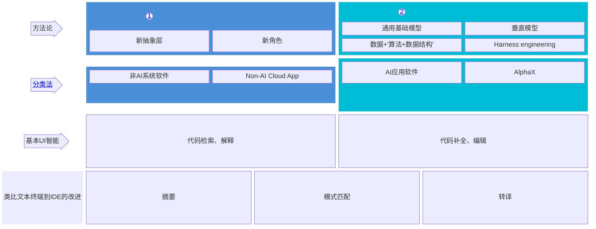

# AISMM

## 定义研究的问题、范围和目的

1️⃣最近的技术进展❌

比谁看到的更多更全面？

总结成功经验和规律？还没有“经验”经过长时间考验可以称之为“成功”。比如Claude code的设计被外界做各种解读，[实际都是为了以最简单的方式开始探索](https://www.youtube.com/watch?v=PQU9o_5rHC4)，无从衡量模型还是设计因素贡献更大。

针对特定人群的认知提升？

2️⃣在具体问题上用具体AI方案能做到什么效果

[机器学习适用性（Suitability for Machine Learning, SML）指标](reference/SML-report.md)没有及时更新的具体的AI方案①，O*NET也没有针对特定软件类型的操作粒度②。
分类细化②——SWE Task Network & Taxonomy，可以对应到评测数据集，对①进行Eval。

## 分类分析框架

## AI4SE White Paper

依据初步讨论达成以下共识：
- 本次白皮书的内容，重点放在对相应的范式、技术、工具和案例等 进行调研、分析和总结; 
- 文章中可以适当提出一些价值主张，但是对于不确定的发展趋势、未经试验的想法和观点等，暂时不在白皮书中做深入探讨。

白皮书的草稿暂时使用 gitbook 进行组织：
- [gitbook.md](gitbook.md) 中是 gitbook 的安装和配置过程；如果只是文章撰写，不编译和发布则无需安装和配置 gitbook；
- SUMMARY.md 是书籍的目录，gitbook 会按照该文件生成相应的章节 markdown 文件, 修改目录大纲直接编辑 SUMMARY.md；
- 根据大纲生成 markdown 文件后，直接编辑对应章节的 markdown 文件完成内容编写；
- 如果要生成并发布电子书，参考 gitbook.md 配置 gitbook 工具；
